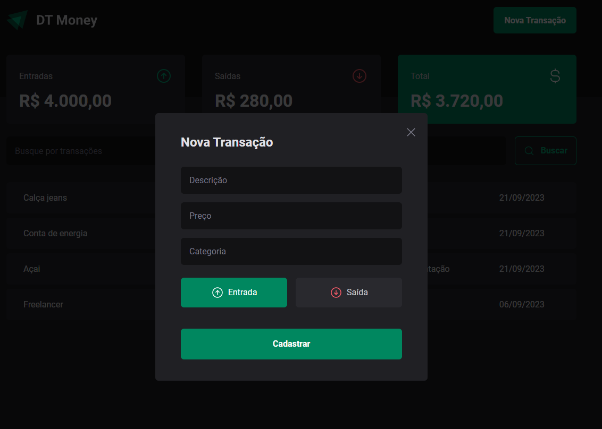

<!--<div align='center'>
  
  
</div>-->

# Sobre o projeto 💬

O **Dt_Money** é uma aplicação web desenvolvida na Rocketseat, sobre uma aplicação para controle financeiro

## Funcionalidades 🧠

###  📕 A aplicação contém as seguintes funcionalidades:

- [x] Criar transação
- [x] Listar todas as transações
- [x] Filtrar as transações
- [x] Visualizar um resumo sobre as transações (Entradas, Saídas, Total)

## Pré-requisitos
#### Antes de começar, é bom ter instalado em sua maquina as seguintes ferramentas:
- [x] [GIT](https://git-scm.com/)
- [x] [VSCode](https://code.visualstudio.com/)
- [x] [NodeJs](https://nodejs.org/en/)

### Rodando o Projeto 📖

```bash
# Clone para este repositório
$ git clone https://github.com/Pedro-AugusCoelho/Dt_Money.git

# Acesse a pasta do projeto no terminal/cmd
$ cd Dt_Money

# Instale as dependências
$ npm install/yarn

# Execute a aplicação em modo de desenvolvimento
$ npm run dev / yarn dev

# O front iniciará na porta:5173 - acesse <http://127.0.0.1:5173>
# A api fake iniciará na porta:3000 - acesse <http://127.0.0.1:3000>
```

## Tecnologias 🛠

Desenvolvido utilizando as seguintes tecnologias:

- [REACT.JS](https://reactjs.org/)
- [VITE](https://vitejs.dev/)
- [TYPESCRIPT](https://www.typescriptlang.org/)
- [STYLED-COMPONENTS](https://styled-components.com/)
- [PHOSPHOR-REACT](https://phosphoricons.com/)
- [RADIX-UI](https://www.radix-ui.com/themes/docs/overview/getting-started)
- [REACT-HOOK-FORM](https://www.react-hook-form.com/)
- [ZOD](https://zod.dev/)
- [JSON-SERVER](https://www.npmjs.com/package/json-server)
- [AXIOS](https://www.npmjs.com/package/axios)
- [ESLINT](https://eslint.org/)

## Desenvolvido ##

- [Rocketseat](https://www.rocketseat.com.br/index)
